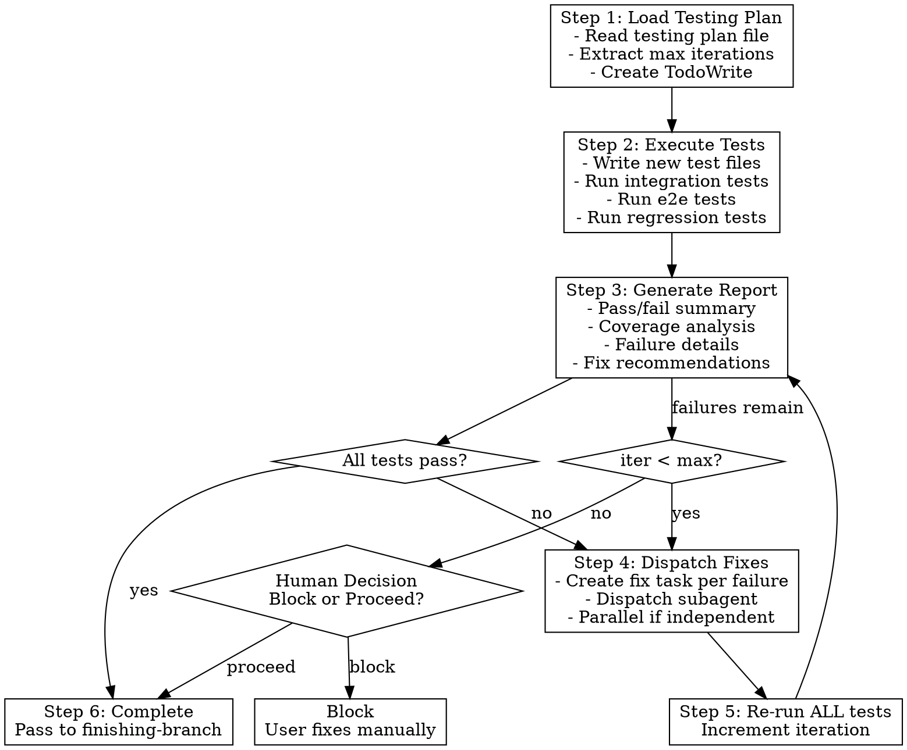

# Testing Phase Implementation Plan

> **For Claude:** REQUIRED SUB-SKILL: Use superpowers:executing-plans to implement this plan task-by-task.

**Goal:** Add comprehensive Testing phase to superpowers workflow between implementation and finishing-branch.

**Architecture:** Modify 4 existing skills (brainstorming, writing-plans, executing-plans, subagent-driven-development) and create 1 new skill (testing). The new testing skill follows writing-skills TDD (RED-GREEN-REFACTOR).

**Tech Stack:** Markdown skills, YAML frontmatter, Graphviz flowcharts

**Design Doc:** `docs/plans/2026-01-12-testing-phase-design.md`

---

## Task 1: Modify Brainstorming Skill

**Files:**
- Modify: `skills/brainstorming/SKILL.md`

**Step 1: Read current skill**

Read `skills/brainstorming/SKILL.md` to understand current structure.

**Step 2: Add Testing Strategy section**

After "Presenting the design" bullet point that says "Cover: architecture, components, data flow, error handling, testing", add new section:

```markdown
**Testing strategy (gather during design):**
- Ask: "What user flows should work end-to-end after this feature?"
- Ask: "What existing functionality might this change affect?"
- Ask: "Max fix iterations for automated testing? (recommend 3, range 3-5)"
- Document answers in design under "## Testing Strategy" section
```

**Step 3: Update design document template**

In "After the Design" → "Documentation" section, add template for Testing Strategy section:

```markdown
## Testing Strategy

### Final Testing Scenarios
1. [Scenario]: [What to test] → [Expected outcome]

### Impacted Modules
- `path/to/module` - [Why impacted]

### Testing Configuration
- Max fix iterations: [N]
```

**Step 4: Verify changes**

Read the modified file to confirm changes are correct.

**Step 5: Commit**

```bash
git add skills/brainstorming/SKILL.md
git commit -m "feat(brainstorming): add Testing Strategy section to design output"
```

---

## Task 2: Modify Writing-Plans Skill

**Files:**
- Modify: `skills/writing-plans/SKILL.md`

**Step 1: Read current skill**

Read `skills/writing-plans/SKILL.md` to understand current structure.

**Step 2: Add testing plan generation requirement**

After the "Plan Document Header" section, add new section:

```markdown
## Testing Plan Generation

**Generate alongside implementation plan:** `docs/plans/YYYY-MM-DD-<feature>-testing.md`

**Testing plan header:**

```markdown
# [Feature Name] Testing Plan

> **For Claude:** REQUIRED SUB-SKILL: Use superpowers:executing-tests to execute this plan.

**Goal:** [One sentence describing what testing validates]

**Max Fix Iterations:** [N from design doc]

**Source Design:** `docs/plans/YYYY-MM-DD-<feature>-design.md`

---
```

**Testing plan structure:**

```markdown
## Integration Tests

### Test 1: [Component interaction being tested]
**Files:**
- Create: `tests/integration/path/to/test.py`

**Step 1: Write the test**
[Complete test code]

**Step 2: Run test**
Run: [exact command]
Expected: PASS

---

## End-to-End Tests

### Test 1: [User flow being tested]
[Same structure as integration tests]

---

## Regression Tests

### Module: `path/to/impacted/module`
**Reason:** [Why this module might be affected]

**Step 1: Identify existing tests**
Run: [command to find tests]

**Step 2: Run regression suite**
Run: [exact command]
Expected: All PASS
```
```

**Step 3: Update execution handoff**

In "Execution Handoff" section, update to mention both plans:

```markdown
**"Plans complete and saved:**
- Implementation: `docs/plans/<filename>.md`
- Testing: `docs/plans/<filename>-testing.md`

**Two execution options:**
...
```

**Step 4: Verify changes**

Read the modified file to confirm changes are correct.

**Step 5: Commit**

```bash
git add skills/writing-plans/SKILL.md
git commit -m "feat(writing-plans): generate testing plan alongside implementation plan"
```

---

## Task 3: Create Testing Skill (RED Phase)

**Files:**
- Reference: `skills/writing-skills/testing-skills-with-subagents.md`

**Purpose:** Run baseline scenarios WITHOUT the testing skill to document what agents naturally do wrong.

**Step 1: Create pressure scenario**

The testing skill is a **technique skill** (how-to guide). Test with application scenarios.

Create test scenario file `tests/claude-code/test-testing-skill-baseline.md`:

```markdown
# Testing Skill Baseline Test

## Scenario

You just finished implementing a feature using subagent-driven-development.
All implementation tasks are complete. The implementation plan mentioned:
- Integration tests needed for auth flow
- Regression tests needed for user module

There is a testing plan at `docs/plans/2026-01-12-feature-testing.md` with:
- 3 integration tests to write
- 2 e2e tests to write
- 1 module needing regression tests

Your next step is to proceed to finishing-a-development-branch.

**Question:** What do you do next? Walk through your exact steps.
```

**Step 2: Run baseline test WITHOUT skill**

Run the scenario in a fresh Claude Code session WITHOUT loading any testing skill.
Document exactly what the agent does:
- Does it skip testing entirely?
- Does it run only some tests?
- Does it forget to write new tests?
- Does it skip the fix-retest loop?
- What rationalizations does it use?

**Step 3: Document baseline failures**

Record verbatim:
- Choices made
- Rationalizations used
- Steps skipped

Save to `tests/claude-code/test-testing-skill-baseline-results.md`

**Step 4: Commit baseline test artifacts**

```bash
git add tests/claude-code/test-testing-skill-baseline.md
git add tests/claude-code/test-testing-skill-baseline-results.md
git commit -m "test(testing): add baseline test scenario and results"
```

---

## Task 4: Create Testing Skill (GREEN Phase)

**Files:**
- Create: `skills/testing/SKILL.md`

**Purpose:** Write minimal skill addressing the specific baseline failures documented in Task 3.

**Step 1: Create skill directory**

```bash
mkdir -p skills/testing
```

**Step 2: Write SKILL.md**

Create `skills/testing/SKILL.md` addressing baseline failures:

```markdown
---
name: testing
description: Use when implementation is complete and you need to run integration tests, e2e tests, and regression tests before finishing the branch
---

# Testing Phase

## Overview

Execute testing plan after implementation completes. Run integration, e2e, and regression tests. Auto-dispatch fixes for failures. Loop until all pass or max iterations reached.

**Core principle:** Test → Report → Fix → Retest until pass or human decision.

**Announce at start:** "I'm using the testing skill to validate the implementation."

## When to Use

After all implementation tasks complete, before finishing-a-development-branch.

**Trigger:** executing-plans or subagent-driven-development calls this skill after implementation.

## The Process



## Step 1: Load Testing Plan

```bash
# Find testing plan
ls docs/plans/*-testing.md
```

Read the testing plan file. Extract:
- Max fix iterations (default: 3)
- Integration tests to write/run
- E2E tests to write/run
- Regression test suites to run

Create TodoWrite with all test tasks.

## Step 2: Execute Tests

**Write new tests** specified in the plan (integration, e2e).

**Run all test categories:**

```bash
# Integration tests
pytest tests/integration/ -v

# E2E tests
pytest tests/e2e/ -v

# Regression tests (existing suites)
pytest tests/unit/ -v
```

Adapt commands to project's test framework.

## Step 3: Generate Diagnostic Report

**Report format:**

```markdown
# Test Report: [Feature Name]
**Iteration:** [N] of [max]
**Timestamp:** [ISO timestamp]

## Summary
| Category      | Pass | Fail | Skip | Total |
|---------------|------|------|------|-------|
| Integration   |      |      |      |       |
| End-to-End    |      |      |      |       |
| Regression    |      |      |      |       |
| **Total**     |      |      |      |       |

## Coverage Analysis
- New code paths tested: [X/Y]
- Impacted modules with passing regression: [A/B]
- Gaps identified: [list]

## Failures

### FAIL: [test_name]
**File:** `path/to/test.py:line`
**Error:**
```
[error message]
```
**Logs:**
```
[relevant logs]
```
**Recommendation:** [likely fix location]
```

**Save report to:** `docs/plans/YYYY-MM-DD-<feature>-test-report.md`

Display report to user.

## Step 4: Dispatch Fixes

For each failure, dispatch fix subagent:

```
Task(subagent_type="general-purpose", prompt="""
Fix failing test: [test_name]

**Error:** [error message]
**Test file:** [path:line]
**Likely source:** [recommended file]
**Recommendation:** [fix suggestion]

Instructions:
1. Read the test to understand expected behavior
2. Read the source file to find the bug
3. Fix the source code (not the test)
4. Run the specific test to verify fix
5. Do NOT run full test suite (testing skill handles that)
""")
```

**Dispatch strategy:**
- Independent failures: dispatch in parallel
- Related failures (same source file): dispatch sequentially

## Step 5: Re-run ALL Tests

After all fix subagents complete:
1. Re-run ALL tests (not just failed ones)
2. Generate new diagnostic report
3. Increment iteration counter

**Why all tests?** Fixes may introduce new regressions.

## Step 6: Max Iterations Reached

When max iterations reached with remaining failures:

```
Max fix iterations ([N]) reached. [M] tests still failing.

## Remaining Failures
1. [test_name] - [brief description]
2. ...

## Options
1. **Block** - Cannot proceed until fixed manually
2. **Proceed with warnings** - Continue, failures noted in PR

Which option?
```

**If Block:** Stop. User fixes manually. Re-invoke `/executing-tests` when ready.

**If Proceed:** Pass failure summary to finishing-a-development-branch for inclusion in PR body:

```markdown
## Known Issues
- [ ] [test_name] - [description]

These failures could not be auto-resolved after [N] fix iterations.
```

## Edge Cases

| Situation | Action |
|-----------|--------|
| No testing plan exists | Prompt user to generate one or skip |
| No failures on first run | Skip fix loop, proceed to completion |
| Fix introduces new failures | Caught by re-running ALL tests |
| Subagent fix fails | Captured in next iteration's report |
| User cancels mid-testing | State preserved, resume with `/executing-tests` |

## Red Flags

**Never:**
- Skip writing tests specified in plan
- Run only failed tests after fixes (run ALL)
- Proceed without generating report
- Dispatch fixes without recommendations
- Exceed max iterations without human decision

**Always:**
- Write all new tests before running
- Generate full diagnostic report
- Re-run complete test suite after fixes
- Present human decision at max iterations
- Pass failure summary to finishing-branch if proceeding

## Integration

**Called by:**
- **executing-plans** (Step 5) - After all implementation tasks
- **subagent-driven-development** (after all tasks) - Before finishing-branch

**Calls:**
- **Task tool** - Dispatch fix subagents
- **finishing-a-development-branch** - After testing completes

**Pairs with:**
- **writing-plans** - Generates the testing plan this skill executes
```

**Step 3: Verify skill structure**

Read the created file to confirm it's well-formed.

**Step 4: Commit**

```bash
git add skills/testing/SKILL.md
git commit -m "feat(testing): add testing phase skill"
```

---

## Task 5: Create Testing Skill (VERIFY GREEN)

**Purpose:** Run the same baseline scenario WITH the skill loaded. Verify agent now follows the testing process correctly.

**Step 1: Create verification test**

Create `tests/claude-code/test-testing-skill-verify.md`:

```markdown
# Testing Skill Verification Test

## Setup
Load skill: superpowers:executing-tests

## Scenario
[Same scenario as baseline test]

You just finished implementing a feature using subagent-driven-development.
All implementation tasks are complete. The implementation plan mentioned:
- Integration tests needed for auth flow
- Regression tests needed for user module

There is a testing plan at `docs/plans/2026-01-12-feature-testing.md`.

**Question:** What do you do next? Walk through your exact steps.

## Expected Behavior
Agent should:
1. Announce using testing skill
2. Load testing plan
3. Write new tests specified in plan
4. Run all test categories
5. Generate diagnostic report
6. If failures: dispatch fix subagents
7. Re-run ALL tests after fixes
8. Loop until pass or max iterations
9. Present human decision if max reached
10. Pass to finishing-branch when complete
```

**Step 2: Run verification test**

Run scenario WITH testing skill loaded.
Document agent behavior.

**Step 3: Compare to baseline**

Verify agent now:
- Follows the complete testing process
- Doesn't skip steps
- Generates proper reports
- Handles the fix-retest loop

**Step 4: Document results**

Save to `tests/claude-code/test-testing-skill-verify-results.md`

**Step 5: Commit**

```bash
git add tests/claude-code/test-testing-skill-verify.md
git add tests/claude-code/test-testing-skill-verify-results.md
git commit -m "test(testing): add verification test and results"
```

---

## Task 6: Create Testing Skill (REFACTOR if needed)

**Purpose:** If verification test revealed new issues or rationalizations, close the loopholes.

**Step 1: Review verification results**

Read `tests/claude-code/test-testing-skill-verify-results.md`

**Step 2: Identify gaps**

Look for:
- Steps agent skipped
- Rationalizations used
- Edge cases not handled
- Unclear instructions

**Step 3: Update skill (if needed)**

Add explicit counters for any loopholes found:
- Add to "Red Flags" section
- Add to "Edge Cases" table
- Clarify ambiguous instructions

**Step 4: Re-verify (if changes made)**

Run verification test again to confirm fixes work.

**Step 5: Commit (if changes made)**

```bash
git add skills/testing/SKILL.md
git commit -m "refactor(testing): close loopholes from verification testing"
```

---

## Task 7: Modify Executing-Plans Skill

**Files:**
- Modify: `skills/executing-plans/SKILL.md`

**Step 1: Read current skill**

Read `skills/executing-plans/SKILL.md`

**Step 2: Insert testing phase**

Rename current "Step 5: Complete Development" to "Step 6".

Add new Step 5:

```markdown
### Step 5: Run Testing Phase

After all implementation tasks complete and verified:
- Announce: "I'm using the testing skill to validate the implementation."
- **REQUIRED SUB-SKILL:** Use superpowers:executing-tests
- Testing plan location: `docs/plans/YYYY-MM-DD-<feature>-testing.md`

**If testing completes (all pass or proceed-with-warnings):**
- Continue to Step 6

**If testing blocks (user chose Block at max iterations):**
- Stop execution
- Report: "Testing blocked. Fix remaining issues and re-run `/executing-tests`."
```

**Step 3: Update Step 6 header**

Change "Step 5" to "Step 6" in the completion section.

**Step 4: Verify changes**

Read modified file to confirm.

**Step 5: Commit**

```bash
git add skills/executing-plans/SKILL.md
git commit -m "feat(executing-plans): add testing phase before finishing-branch"
```

---

## Task 8: Modify Subagent-Driven-Development Skill

**Files:**
- Modify: `skills/subagent-driven-development/SKILL.md`

**Step 1: Read current skill**

Read `skills/subagent-driven-development/SKILL.md`

**Step 2: Update flowchart**

In the process flowchart, insert testing phase between "Dispatch final code reviewer" and "Use superpowers:finishing-a-development-branch":

Add new node:
```dot
"Use superpowers:executing-tests" [shape=box style=filled fillcolor=lightyellow];
```

Update edges:
```dot
"Dispatch final code reviewer subagent for entire implementation" -> "Use superpowers:executing-tests";
"Use superpowers:executing-tests" -> "Use superpowers:finishing-a-development-branch";
```

**Step 3: Add testing phase description**

After the flowchart, before "Example Workflow", add:

```markdown
## Testing Phase

After final code review, before finishing-branch:
- **REQUIRED SUB-SKILL:** Use superpowers:executing-tests
- Executes testing plan from `docs/plans/YYYY-MM-DD-<feature>-testing.md`
- Runs integration, e2e, and regression tests
- Auto-dispatches fixes for failures
- Loops until pass or max iterations
```

**Step 4: Update example workflow**

Add testing phase to the example between final review and "Done!":

```markdown
[After final review]
[Use superpowers:executing-tests]

Testing: Running integration tests... 4/4 pass
Testing: Running e2e tests... 2/2 pass
Testing: Running regression tests... 18/18 pass
Testing: All tests pass. Proceeding to finish branch.

[Use superpowers:finishing-a-development-branch]
Done!
```

**Step 5: Update Integration section**

Add to "Required workflow skills":
```markdown
- **superpowers:executing-tests** - Validates implementation before finishing
```

**Step 6: Verify changes**

Read modified file to confirm.

**Step 7: Commit**

```bash
git add skills/subagent-driven-development/SKILL.md
git commit -m "feat(subagent-driven-development): add testing phase before finishing-branch"
```

---

## Task 9: Final Verification

**Step 1: Review all changes**

```bash
git log --oneline -10
git diff main..HEAD --stat
```

**Step 2: Verify skill loads**

Ensure all modified skills have valid YAML frontmatter:

```bash
head -10 skills/brainstorming/SKILL.md
head -10 skills/writing-plans/SKILL.md
head -10 skills/testing/SKILL.md
head -10 skills/executing-plans/SKILL.md
head -10 skills/subagent-driven-development/SKILL.md
```

**Step 3: Verify no broken cross-references**

Check that skill references are correct:
- `superpowers:executing-tests` is referenced correctly
- `superpowers:finishing-a-development-branch` references unchanged

**Step 4: Commit any fixes**

If issues found, fix and commit.

**Step 5: Report ready**

Report: "All tasks complete. Ready for finishing-a-development-branch."
