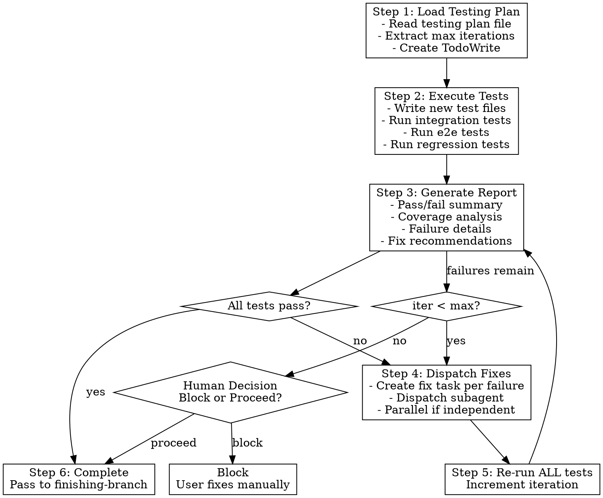

# Testing Phase

## Overview

Execute testing plan after implementation completes. Run integration, e2e, and regression tests. Auto-dispatch fixes for failures. Loop until all pass or max iterations reached.

**Core principle:** Test → Report → Fix → Retest until pass or human decision.

**Announce at start:** "I'm using the testing skill to validate the implementation."

## When to Use

After all implementation tasks complete, before finishing-a-development-branch.

**Trigger:** executing-plans or subagent-driven-development calls this skill after implementation.

## The Process



## Step 1: Load Testing Plan

```bash
# Find testing plan
ls docs/plans/*-testing.md
```

Read the testing plan file. Extract:
- Max fix iterations (default: 3)
- Integration tests to write/run
- E2E tests to write/run
- Regression test suites to run

Create TodoWrite with all test tasks.

## Step 2: Execute Tests

**Write new tests** specified in the plan (integration, e2e).

**Run all test categories:**

```bash
# Integration tests
pytest tests/integration/ -v

# E2E tests
pytest tests/e2e/ -v

# Regression tests (existing suites)
pytest tests/unit/ -v
```

Adapt commands to project's test framework.

## Step 3: Generate Diagnostic Report

**Report format:**

```markdown
# Test Report: [Feature Name]
**Iteration:** [N] of [max]
**Timestamp:** [ISO timestamp]

## Summary
| Category      | Pass | Fail | Skip | Total |
|---------------|------|------|------|-------|
| Integration   |      |      |      |       |
| End-to-End    |      |      |      |       |
| Regression    |      |      |      |       |
| **Total**     |      |      |      |       |

## Coverage Analysis
- New code paths tested: [X/Y]
- Impacted modules with passing regression: [A/B]
- Gaps identified: [list]

## Failures

### FAIL: [test_name]
**File:** `path/to/test.py:line`
**Error:**
```
[error message]
```
**Logs:**
```
[relevant logs]
```
**Recommendation:** [likely fix location]
```

**Save report to:** `docs/plans/YYYY-MM-DD-<feature>-test-report.md`

Display report to user.

## Step 4: Dispatch Fixes

For each failure, dispatch fix subagent:

```
Task(subagent_type="general-purpose", prompt="""
Fix failing test: [test_name]

**Error:** [error message]
**Test file:** [path:line]
**Likely source:** [recommended file]
**Recommendation:** [fix suggestion]

Instructions:
1. Read the test to understand expected behavior
2. Read the source file to find the bug
3. Fix the source code (not the test)
4. Run the specific test to verify fix
5. Do NOT run full test suite (testing skill handles that)
""")
```

**Dispatch strategy:**
- Independent failures: dispatch in parallel
- Related failures (same source file): dispatch sequentially

## Step 5: Re-run ALL Tests

After all fix subagents complete:
1. Re-run ALL tests (not just failed ones)
2. Generate new diagnostic report
3. Increment iteration counter

**Why all tests?** Fixes may introduce new regressions.

## Step 6: Max Iterations Reached

When max iterations reached with remaining failures:

```
Max fix iterations ([N]) reached. [M] tests still failing.

## Remaining Failures
1. [test_name] - [brief description]
2. ...

## Options
1. **Block** - Cannot proceed until fixed manually
2. **Proceed with warnings** - Continue, failures noted in PR

Which option?
```

**If Block:** Stop. User fixes manually. Re-invoke `/testing` when ready.

**If Proceed:** Pass failure summary to finishing-a-development-branch for inclusion in PR body:

```markdown
## Known Issues
- [ ] [test_name] - [description]

These failures could not be auto-resolved after [N] fix iterations.
```

## Edge Cases

| Situation | Action |
|-----------|--------|
| No testing plan exists | Prompt user to generate one or skip |
| No failures on first run | Skip fix loop, proceed to completion |
| Fix introduces new failures | Caught by re-running ALL tests |
| Subagent fix fails | Captured in next iteration's report |
| User cancels mid-testing | State preserved, resume with `/testing` |

## Red Flags

**Never:**
- Skip writing tests specified in plan
- Run only failed tests after fixes (run ALL)
- Proceed without generating report
- Dispatch fixes without recommendations
- Exceed max iterations without human decision

**Always:**
- Write all new tests before running
- Generate full diagnostic report
- Re-run complete test suite after fixes
- Present human decision at max iterations
- Pass failure summary to finishing-branch if proceeding

## Integration

**Called by:**
- **executing-plans** (Step 5) - After all implementation tasks
- **subagent-driven-development** (after all tasks) - Before finishing-branch

**Calls:**
- **Task tool** - Dispatch fix subagents
- **finishing-a-development-branch** - After testing completes

**Pairs with:**
- **writing-plans** - Generates the testing plan this skill executes
